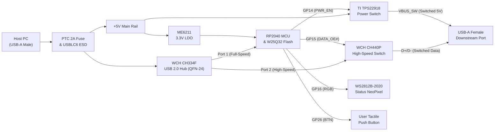

# 📐 ControlledUsb Hardware Design & Schematic Guide

**Version**: 1.0 (Monolithic Production Architecture)  
**Form Factor**: Slim USB Dongle (approx. 19 mm × 54 mm)  
**Target Fabrication**: JLCPCB 4-Layer PCB with SMT Assembly (Target total order < $55 USD)

---

## 1. System Architecture Overview

---

## 2. Detailed Circuit Subsystems & Pin Connections

### Block 1: Upstream USB Input & Protection
* **Connector `J1`**: USB-A Male Plug (SMD + Through-hole retention tabs, LCSC `C77873`).
* **Overcurrent Protection `F1`**: 2.0A Hold / 4.0A Trip Resettable PTC Fuse (1206, LCSC `C394336`) in series with `VBUS`.
  * `VBUS_RAW` $\rightarrow$ `F1` $\rightarrow$ `+5V` Net.
* **ESD Protection `U7`**: USBLC6-2SC6 (SOT-23-6, LCSC `C7519`):
  * Pin 1 (`I/O1`): Upstream $D-$
  * Pin 2 (`GND`): System Ground
  * Pin 3 (`I/O2`): Upstream $D+$
  * Pin 4 (`I/O2`): Tied to Pin 3
  * Pin 5 (`VBUS`): Connected to `+5V`
  * Pin 6 (`I/O1`): Tied to Pin 1
* **Input Bulk Decoupling**: $10\mu\text{F}$ 16V ceramic (`C13`) + $100\text{nF}$ ceramic (`C3`).

---

### Block 2: 3.3V Power Supply (LDO)
* **Regulator `U6`**: MicrOne ME6211C33M5G-N (SOT-23-5, LCSC `C82942`):
  * Pin 1 (`VIN`): Connected to `+5V`
  * Pin 2 (`GND`): Ground
  * Pin 3 (`EN`): Connected to `+5V`
  * Pin 4 (`NC/BYP`): Open
  * Pin 5 (`VOUT`): `+3V3` Net (supplies RP2040 and Flash).
* **Decoupling**: $10\mu\text{F}$ 16V ceramic on input (`C14`) and output (`C15`).

---

### Block 3: USB 2.0 Hub Controller (WCH CH334F)
* **IC `U3`**: WCH CH334F (QFN-24, 4×4 mm, LCSC `C5142940`):
  * **Pin 19 (`V5`)**: Connects to `+5V` (with $10\mu\text{F}$ `C16` + $100\text{nF}$ `C4` to GND).
  * **Pin 20 (`V33`)**: Internal 3.3V LDO output. Decouple with $1\mu\text{F}$ `C11` + $100\text{nF}$ `C5` to GND.
  * **Pin 25 (Exposed Pad / EPAD)**: Direct connection to solid Ground plane.
  * **Pins 3 (`XOUT`) & 4 (`XIN`)**: 12.000 MHz SMD Crystal (`Y2`, 3225 package, LCSC `C16212`).
  * **Upstream Port**:
    * Pin 15 (`D+U`): Connects to Host $D+$
    * Pin 14 (`D-U`): Connects to Host $D-$
  * **Port 1 (Internal Controller Link to RP2040)**:
    * Pin 12 (`D+1`): Connects to RP2040 `USB_DP` through $27\ \Omega$ series resistor (`R1`).
    * Pin 11 (`D-1`): Connects to RP2040 `USB_DM` through $27\ \Omega$ series resistor (`R2`).
  * **Port 2 (Switched Peripheral Link)**:
    * Pin 10 (`D+2`): Connects to CH440P Pin 4 (`DA`).
    * Pin 9 (`D-2`): Connects to CH440P Pin 12 (`DD`).
  * **Unused Pins**:
    * Pins 5, 6, 7, 8 (Ports 3 & 4 data lines): Leave Floating / NC.
    * Pin 1 (`!OVCUR`): Pull up to 3.3V or leave NC (internal pull-up).
    * Pin 16 (`!RESET`): Leave NC (internal power-on reset).
    * Pin 18 (`PSELF`): Connect to GND (Bus-powered mode).

---

### Block 4: Microcontroller Core (Raspberry Pi RP2040)
* **MCU `U1`**: Raspberry Pi RP2040 (QFN-56, 7×7 mm, LCSC `C2040`):
  * **Power Supply**:
    * `IOVDD` (Pins 1, 10, 22, 33, 42, 49) $\rightarrow$ `+3V3` Net (each with a $100\text{nF}$ cap `C6`, `C7`, `C8`, `C9`).
    * `DVDD` (Pins 23, 50) $\rightarrow$ `+1V1` Net (internal core voltage).
    * `VREG_VIN` (Pin 44) $\rightarrow$ `+3V3`.
    * `VREG_VOUT` (Pin 45) $\rightarrow$ `+1V1` Net, decoupled with $1\mu\text{F}$ `C12` + $100\text{nF}$ `C10`.
    * `USB_VDD` (Pin 48) $\rightarrow$ `+3V3`.
    * `ADC_AVDD` (Pin 43) $\rightarrow$ `+3V3`.
    * `GND` (Pin 57 EPAD) $\rightarrow$ Direct Ground plane.
  * **Clock**:
    * Pins 20 (`XIN`) & 21 (`XOUT`) $\rightarrow$ 12.000 MHz Crystal (`Y1`, LCSC `C16212`) with $15\text{pF}$ loading caps (`C1`, `C2`) to GND.
  * **USB 1.1 / 2.0 Interface**:
    * Pin 46 (`USB_DM`) $\rightarrow$ $27\ \Omega$ (`R2`) $\rightarrow$ CH334F Pin 11 (`D-1`).
    * Pin 47 (`USB_DP`) $\rightarrow$ $27\ \Omega$ (`R1`) $\rightarrow$ CH334F Pin 12 (`D+1`).
  * **SPI Flash Memory `U2`**: Winbond W25Q32JVSSIQ (SOIC-8, 4MB, LCSC `C7405788`):
    * `QSPI_SD0` (Pin 53) $\leftrightarrow$ Flash Pin 5 (`DI / IO0`)
    * `QSPI_SD1` (Pin 55) $\leftrightarrow$ Flash Pin 2 (`DO / IO1`)
    * `QSPI_SD2` (Pin 54) $\leftrightarrow$ Flash Pin 3 (`WP# / IO2`)
    * `QSPI_SD3` (Pin 52) $\leftrightarrow$ Flash Pin 7 (`HOLD# / IO3`)
    * `QSPI_SCLK` (Pin 56) $\leftrightarrow$ Flash Pin 6 (`CLK`)
    * `QSPI_SS` (Pin 51) $\leftrightarrow$ Flash Pin 1 (`CS#`)
  * **Buttons**:
    * **BOOT Button `SW2`**: Tactile switch to GND through $1\text{k}\ \Omega$ resistor (`R7`) to `QSPI_SS`.
    * **RESET Button `SW3`**: Tactile switch pulling `RUN` (Pin 26) to GND. (Add $10\text{k}\ \Omega$ pull-up `R8` to `+3V3`).
    * **USER Button `SW1`**: Tactile switch pulling `GP26` (Pin 37) to GND.
  * **Status NeoPixel `D1`**: WS2812B-2020 (LCSC `C2843785`):
    * `DIN` connects to RP2040 `GP16` (Pin 27).
    * `VDD` connects to `+5V` (or `+3V3`), `GND` to Ground.
  * **Control Outputs**:
    * `GP14` (Pin 24) $\rightarrow$ Power switch `ON` net.
    * `GP15` (Pin 25) $\rightarrow$ Data switch `EN#` net.

---

### Block 5: Power Load Switch (TI TPS22918)
* **IC `U4`**: Texas Instruments TPS22918DBVR (SOT-23-6 DBV, LCSC `C2835607`):
  * **Pin 1 (`VIN`)**: Connected to `+5V` bus.
  * **Pin 2 (`GND`)**: System Ground.
  * **Pin 3 (`ON`)**: Connected to RP2040 `GP14` + $10\text{k}\ \Omega$ pull-up (`R5`) to `+5V` (ensures default-ON).
  * **Pin 4 (`CT`)**: Left floating (fast ~100 µs rise time).
  * **Pin 5 (`QOD`)**: Tied directly to Pin 6 (`VOUT`) for active quick discharge to 0V when OFF.
  * **Pin 6 (`VOUT`)**: Output net `VBUS_SW` feeding downstream USB-A female.

---

### Block 6: High-Speed USB Analog Switch (WCH CH440P)
* **IC `U5`**: WCH CH440P (TSSOP-16, LCSC `C53407`):
  * **Pin 1 (`IN`)**: Tied to GND (permanently selects S1 channel).
  * **Pin 2 (`S1A`)**: Switched $D+$ out $\rightarrow$ Downstream USB-A Female $D+$.
  * **Pin 4 (`DA`)**: Hub Port 2 $D+$ in $\rightarrow$ CH334F Pin 10 (`D+2`).
  * **Pin 8 (`GND`)**: System Ground.
  * **Pin 12 (`DD`)**: Hub Port 2 $D-$ in $\rightarrow$ CH334F Pin 9 (`D-2`).
  * **Pin 14 (`S1D`)**: Switched $D-$ out $\rightarrow$ Downstream USB-A Female $D-$.
  * **Pin 15 (`EN#`)**: Active LOW enable $\rightarrow$ Connected to RP2040 `GP15` + $10\text{k}\ \Omega$ pull-down (`R6`) to GND (default-ON).
  * **Pin 16 (`VCC`)**: Connected to `+5V` bus + $100\text{nF}$ decoupling cap to GND.
  * *(Pins 3, 5, 6, 7, 9, 10, 11, 13 are unused/NC).*

---

### Block 7: Downstream USB-A Female & Protection
* **Connector `J2`**: USB-A Female Receptacle (Horizontal Through-Hole tabs, LCSC `C10398`):
  * Pin 1 (`VBUS`): Connected to `VBUS_SW` (from TPS22918 `VOUT`).
  * Pin 2 (`D-`): Connected to CH440P Pin 14 (`S1D`).
  * Pin 3 (`D+`): Connected to CH440P Pin 2 (`S1A`).
  * Pin 4 (`GND`): Connected to System Ground.
  * Shield Tabs: Connected to System Ground.
* **ESD Protection `U8`**: USBLC6-2SC6 (SOT-23-6, LCSC `C7519`) across `VBUS_SW`, $D+$, $D-$, and `GND`.
* **Output Bulk Cap**: $10\mu\text{F}$ 16V ceramic (`C16`) on `VBUS_SW`.

---

## 3. High-Speed 4-Layer PCB Stackup & RF Routing

To ensure flawless **480 Mbps USB 2.0 High-Speed** operation:

### Layer Stackup: JLCPCB JLC04161H (1.6 mm thickness)
* **Layer 1 (Top)**: $90\ \Omega$ Differential Pairs ($D+/D-$) and component pads.
* **Layer 2 (In1)**: **Solid Unbroken Ground (GND) Plane**. (Acts as RF reference for Layer 1).
* **Layer 3 (In2)**: Power distribution (`+5V`, `+3V3`, `+1V1`).
* **Layer 4 (Bottom)**: Low-speed signals, user controls, and ground shield pour.

### $90\ \Omega$ Differential Microstrip Parameters (Layer 1 over Layer 2)
* **Trace Width ($W$)**: $0.15\text{ mm}$ (6 mil)
* **Differential Spacing ($S$)**: $0.15\text{ mm}$ (6 mil)
* **Dielectric Height to GND ($H$)**: $0.1\text{ mm}$ (Prepreg 7628 / 2116)
* **Trace Length Matching**: Skew between $D+$ and $D-$ within each pair must be $< 0.15\text{ mm}$ ($< 6\text{ mil}$).
* **Avoid Vias on USB Pairs**: Route the differential traces entirely on the Top layer without layer transitions.

---

## 4. JLCPCB Assembly & Budget Verification

| Expense Category | 5 Assembled Boards (USD) |
| :--- | :--- |
| **PCB Fabrication (4-Layer, Green/Black, 1.6mm)** | $2.00 |
| **SMT Setup Fee** | $8.00 |
| **SMT Stencil Fee** | $1.50 |
| **LCSC Components (All 5 boards)** | ~$20.00 |
| **Extended Part Loading Fees (~4 parts @ $3)** | ~$12.00 |
| **Shipping to Israel (Global Direct Line)** | ~$12.00 |
| **TOTAL ESTIMATED COST** | **~$55.50 USD** |

✅ **Customs Exemption**: Well under the **$75.00 USD** threshold for 0% VAT and duty-free import into Israel!
